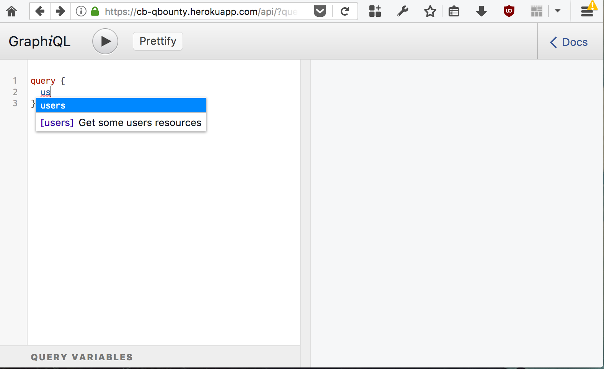
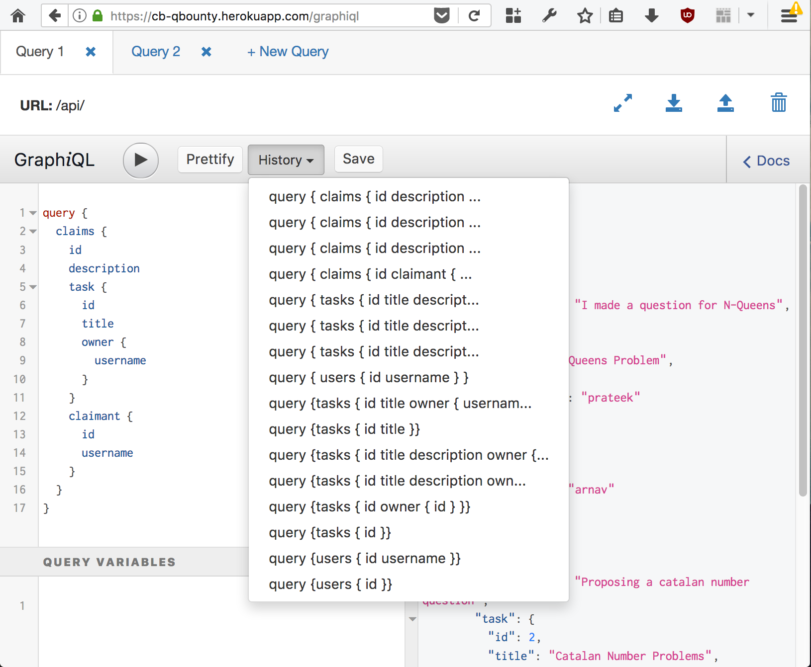

# GraphQL

## Enable GraphiQL
GraphQL endpoints are always generated. We can control whether or not we want to enable
the interactive `GraphiQL` frontend (which provides full autocomplete and ui to fiddle)

To enable `GraphiQL`

```javascript
jagql.setConfig({
    //... other stuff
    base: 'api',
    graphiql: true,
    // ... other stuff
})
```

The GraphiQL console is setup on the base path over HTTP. Browsing `http://localhost:16006/api` 
will show you the following - 



## GraphiQL Toolbox

Some people are okay with `graphiql`, but some people prefer overkill. For them there is
[`express-graphiql-toolbox`](http://npmjs.com/express-graphiql-toolbox). In the package's own words - 

> This package is a standalone lightweight middleware (or route) for express, statically serving a GraphiQL client. It uses the graphql-toolbox version of the graphiql interface, to enable headers, tabs and more (features that people generally want, but will most likely never make it to the official GraphiQL implementation)

If you want to use the full blown toolbox, that's easy too


```javascript
const graphiql = require('express-graphiql-toolbox')
const expressServer = jagql.getExpressServer()
expressServer.use('/graphiql', graphiql({endpoint: '/api/'}))

jagql.start()
```

And this will get you a much more feature-rich GraphiQL console - 


