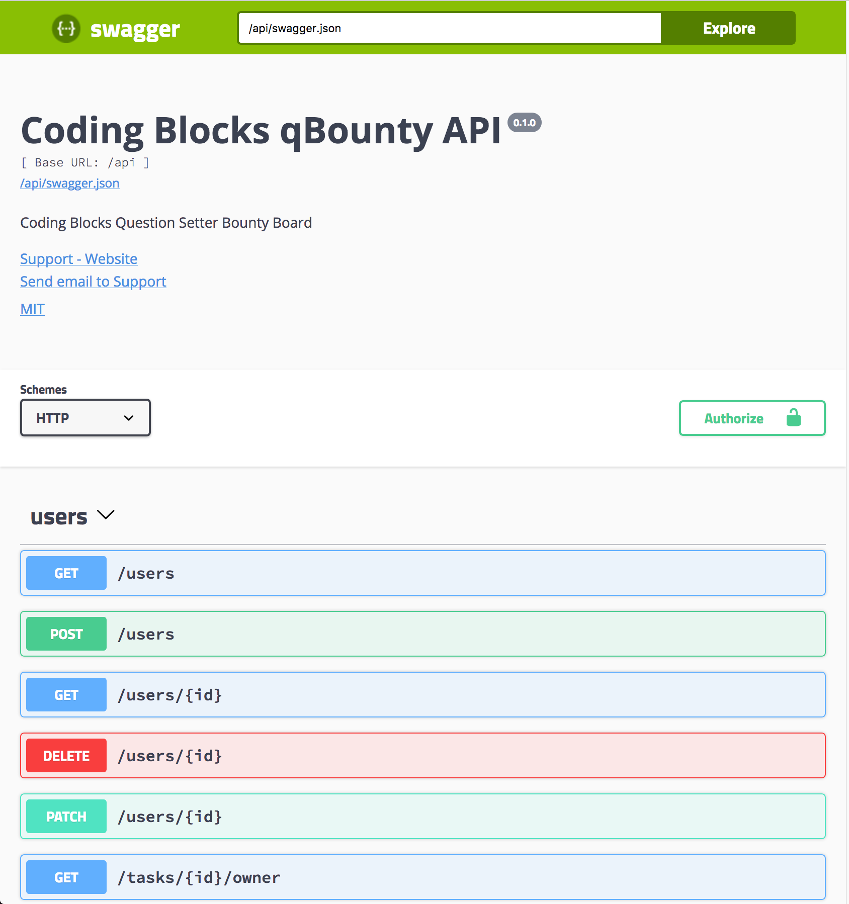

# Swagger

## Automatic Generation

To opt-in to having a `swagger.json` built for you off the back of your resource schema, simply provide a `swagger` property to `jagql.setConfig()` and fill out some of the fields:

```javascript
jagql.setConfig({
  // ...
  swagger: {
    title: "Example JSON:API Server",
    version: "0.1.1",
    description: "This is the API description block that shows up in the swagger.json",
    contact: {
      name: "API Contact",
      email: "apicontact@holidayextras.com",
      url: "docs.hapi.holidayextras.com"
    },
    license: {
      name: "MIT",
      url: "http://opensource.org/licenses/MIT"
    }
  },
  // ...
});
```

When this is done, fire up your api and take a look at your swagger file, found at: `/swagger.json`.

The example app's swagger file is available at `http://localhost:16006/rest/swagger.json`.
## Rendering Swagger UI

You might want to host the Swagger Docs in a Swagger UI page (where users can browse 
and try out the API from their browser) 

To achive this, use [`swagger-ui-express`](http://npmjs.com/swagger-ui-express) and add it to the internal express server
of `jagql`

```javascript
const swaggerUi = require('swagger-ui-express')
const expressServer = jagql.getExpressServer()

expressServer.use('/docs', swaggerUi.serve,
  swaggerUi.setup(
    null, true, null, null, null,
    '/api/swagger.json', 'JAGQL Swagger API Docs'
  )
)
jagql.start()
```

This would look like this on the path `http://localhost:16006/docs` - 




